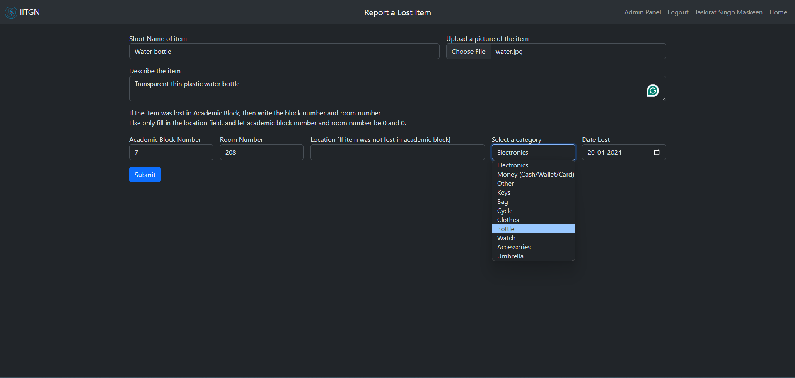
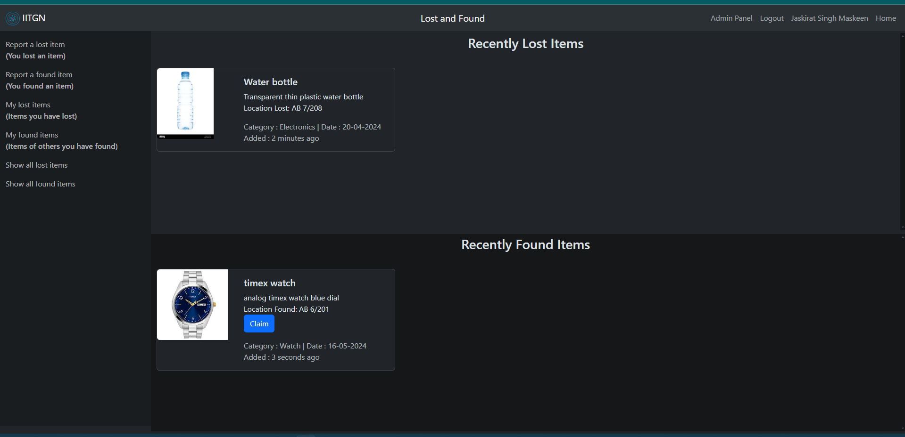
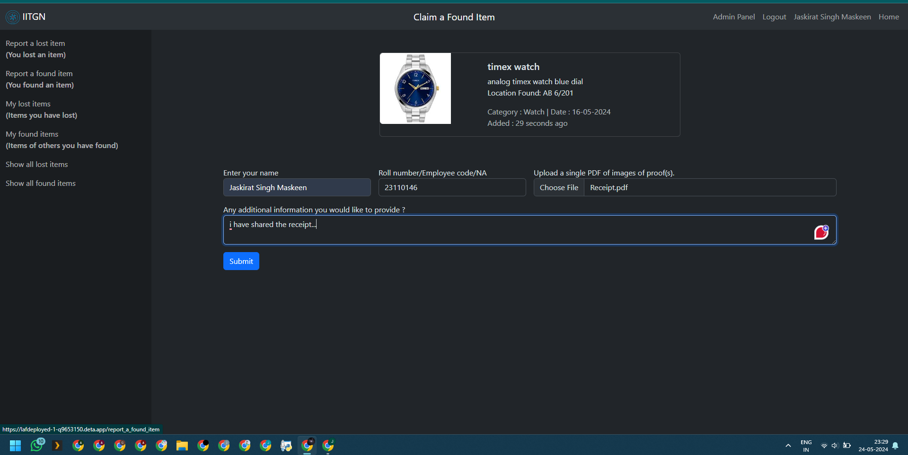
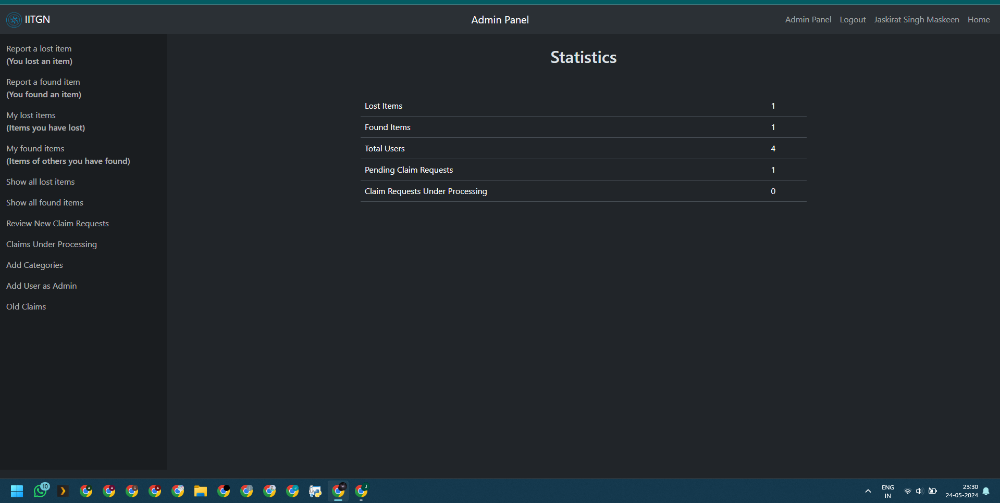
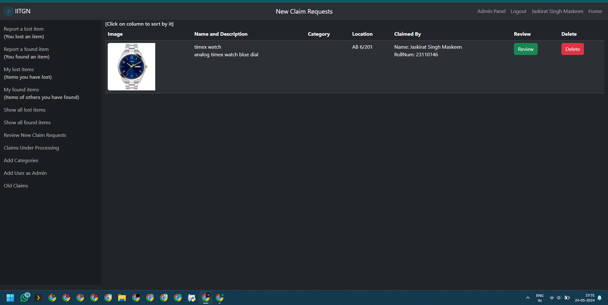
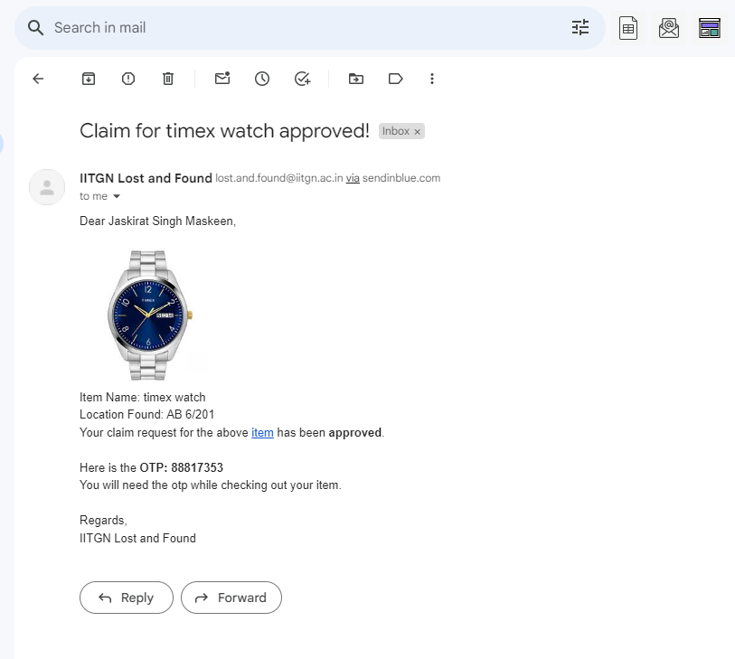

# Lost and Found System 
`This is a project under Metis Winter Projects 2023-24`

## Tech Stack

## For deployment:

### Video: [Youtube](https://youtu.be/GTgK3Z7tlpQ)

### Instructions:
1. Download the zip of the repository
2. Create a virtual environment and activate it (optional)
3. `pip install -r requirements.txt`
4. Go to google cloud console and make a project, get the oauth credentials
5. Go to mongodb and get a database uri.
6. Open [_config.py](./_config.py) and enter details accordingly.
7. Rename it to `config.py`
8. Run the [run_first.py](./run_first.py) file.
9. Then create two search indexes, one for lost_items_db and one for found_items_db on the mongodb site.
10. Run the [run_second](./run_second.py) file.
11. Finally, run `python main.py`

## Images:

1. Reporting a lost item
    
2. User dashboard
    
3. Claiming a found item
    
4. Admin panel
    
5. Pending claim requests
    
6. Review a claim
    
7. OTP sent to mail
    
8. Claim finalization
    